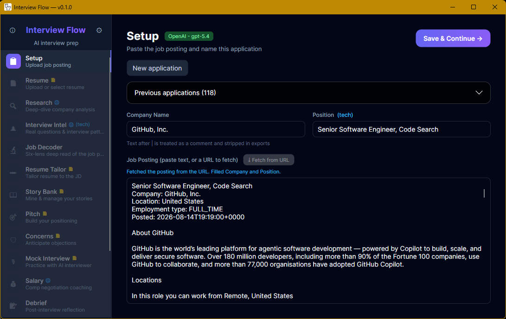

#  Interview Flow (.NET)

[](https://github.com/loxsmoke/interview-flow-net/releases/latest)
[](https://github.com/loxsmoke/interview-flow-net/releases)
[](https://github.com/loxsmoke/interview-flow-net/actions/workflows/ci.yml)

📥 **[Download the latest release](https://github.com/loxsmoke/interview-flow-net/releases/latest)** — portable Windows zip or macOS app bundle, self-contained (no .NET runtime needed).



Native .NET 10 + Avalonia port of [Interview Flow](../interview-flow) — a local AI interview-prep coach. Runs on **Windows and macOS**, shares its **data formats** with the original app, and matches its on-screen markdown rendering.

Design docs live in [`docs/`](docs/README.md) — start there. Architecture decisions are in [`docs/adr/`](docs/adr/).

## What it does

Point it at a job posting and your resume, then work through the twelve steps
down the sidebar. Each one is an AI agent with its own prompt, and every result
is saved locally so you can stop and come back.

| | Step | What it gives you |
|---|---|---|
| 📋 | **Setup** | Paste the posting or a link — Workday, Greenhouse and most job boards are fetched for you |
| 📄 | **Resume** | Upload or paste a resume — PDF, DOCX, TXT, MD — with a saved library across applications |
| 🔍 | **Research** | Deep-dives the company over live web search: culture, tech stack, red flags, fit score |
| 🕵️ | **Interview Intel** | Mines Glassdoor, Blind, Reddit and Levels.fyi for real questions and process details |
| 🔬 | **Job Decoder** | Reads between the lines of the posting across six analytical lenses |
| ✏️ | **Resume Tailor** | Reviews your resume against the JD, drafts a rewrite, exports `.docx`, and coaches you in chat |
| 📖 | **Story Bank** | Extracts STAR stories from your experience with earned-secret insights |
| 🎯 | **Pitch** | Builds 10s / 30s / 60s / 90s pitch variants for the specific role |
| 🛡️ | **Concerns** | Anticipates interviewer objections and prepares counter-evidence |
| 🎙️ | **Mock Interview** | Runs a full simulation with scoring and a debrief |
| 💰 | **Salary** | Researches comp ranges and writes negotiation scripts |
| 📝 | **Debrief** | Post-interview reflection notes, timestamped |

Throughout:

- **Custom actions.** Add your own AI steps, with the whole application context
  available to their prompts via template tags.
- **Bring your own model.** Anthropic, OpenAI, Google Gemini, or a local Ollama
  install — switch providers in Settings; per-query cost is shown as you go.
- **Local-first.** Everything lives in plain files on your machine. No account,
  no cloud sync, and the data format is shared with the original Python app, so
  both can point at one folder.
- **Runs steps in the background.** Queue several sections and keep working;
  the sidebar shows what's running, queued, or failed.

## Build & run

**→ [`docs/10-building.md`](docs/10-building.md)** is the single home for all of
it: prerequisites, first run, the dev loop and tests, the Windows and macOS
packaging steps, and the cross-platform rules to keep.

## Settings

Everything is configured in the app — open **⚙ Configuration** in the sidebar.
There are no files to create or edit; the app writes its own on first save.

- **AI provider** — pick Anthropic, OpenAI, Google Gemini, or a local Ollama
  install, paste an API key, choose a model. That's the whole setup.
- **Resume info** — the name and contact line that go on `.docx` exports.
- **Data folder** — where your applications are kept. Change it and the app
  copies, verifies, and moves your data for you.

Coming from the original Python app? Point the data folder at the one it already
uses and both apps share the same files, or use **Import .env…** to bring your
existing keys across.

Where the files live, the lookup order, and the environment-variable overrides:
[`docs/08-configuration.md`](docs/08-configuration.md).

## Layout

```
src/InterviewFlow.App    Avalonia UI (net10.0, cross-platform)
src/InterviewFlow.Core   domain: models, state store, agents, providers, markdown pipeline
tests/InterviewFlow.Tests xunit; includes the ADR-001b mermaid spike harness
tools/get-mermaid.*      fetches mermaid 11.4.0 for the Jint spike (.ps1 / .sh, not committed)
tools/publish-macos.sh   builds dist/Interview Flow.app (ad-hoc signed)
```

⚠️ Never commit a `.env` here — it holds API keys (see `docs/adr/ADR-002-config-storage.md`).
